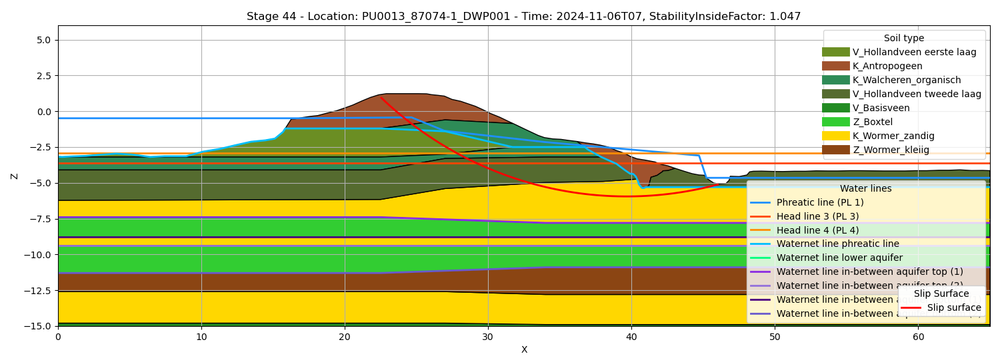

DAM (Dike strength Analysis Module) is een rekenprogramma voor berekeningen rondom de sterkte van dijken. Hiermee kunnen fragility curves worden opgesteld maar ook inzicht verkregen worden in de actuele sterkte. Deze software is ontwikkeld voor de waterschappen door Deltares. DamLive bouwt verder op de rekenmodule onder DAM maar wordt gebruikt om met de huidige waterstanden berekeningen uit te voeren. Het is ontworpen op met Delft-FEWS te werken, maar kan ook gebruikt worden met Toolbox Continu Inzicht.

De koppeling met DamLive bestaat uit twee delen: runnen van DamLive en verwerken van de output. Zie ook de notebook in `tests\examples\development_notebooks\dam_live` voor een volledig voorbeeld van begin tot einds.


### Runnen van DamLive

Om DamLive te runnen vanuit de toolbox moet DamLive geïnstalleerd worden. De binaries (bestanden) en licentie moet via Deltares worden verkregen. De zip met binaries kan worden uitgepakt. Deze locatie moet in het `.env` bestand komen te staan: `DAMLIVE_EXE="...\DamLive.exe"`.
Hiermee kan de toolbox zelf damlive op de juiste manier aanroepen.  Meer informatie over DamLive is [hier](https://publicwiki.deltares.nl/spaces/DAM/pages/160236931/Gebruikershandleiding+DAM-Live) te vinden

#### Installeren

Verifieer of DamLive juist is geïnstalleerd: `...\DamLive.exe --help`.


Als dit goed gaat, zou het volgende moeten verschijnen:

```bash
DamLive 26.1.0.7015
Copyright © Deltares 2026

ERROR(S):
  -d/--damxFile required option is missing.

Usage: damlive[.exe] -d DamXInputFile -i InputTimeSeriesFileName  -o
...
```

Deze opzet is getest met DamLive versie `26.1.0.7015`.


#### Configuratie

Om DamLive te gebruiken moet een `{project_naam}.damx` bestand beschikbaar zijn, dit is uitvoer van een [`Dam stabiliteit`](https://publicwiki.deltares.nl/spaces/DAM/pages/166462239/Aanmaken+DAM+Live+project) berekening. Ook moet een map met de stix bestanden: `{project_naam}.geometries2D` waar in het `.damx` bestand naar wordt verwezen. Deze moeten beide in de `root_dir` staan. De projectnaam moet meegeven worden in de opties van de configuraties, in het configuratie voorbeeld is `project_naam`:  `WV2030_Purmer`.  De logging van `DamLive.exe` kan worden terug gegeven aan de gebruiker, dit is in het voorbeeld terug te vinden.

Om DamLive te runnen moeten twee data adapters worden doorgegeven: grondwaterstanden en parameters. De waterstanden moeten voldoen aan het schema voor belastingen, zie ook de module over[belastingen](modules\belastingen.qmd). De parameters zijn specifiek voor DamLive, deze moet bevatten `parameter_names` en `parameter_values`. Bij het voorbeeld staan twee smaken: Bishop en UpliftVan, deze zijn vanuit DamLive xml bestanden, maar zijn in de Toolbox Continu Inzicht csv bestanden. In de csv bestanden in het scheidingsteken`_`, waarbij `<CalculationModules><StabilityInside>` opgeslagen wordt de parameter naam: `CalculationModules_StabilityInside`.

De uitvoer van de berekening zijn `.stix` bestanden, deze kunnen met `UpdateDamLive.unzip_damlive_results` uitgepakt worden naar een verzameling van `.json` bestanden.

::: {.panel-tabset}
## Configuratie
```yaml
GlobalVariables:
    rootdir: "data_sets"
    moments: [ 0, 24 ]
    calc_time: "2024-11-06 08:00:00"
    UpdateDamLive:
        DAMLIVE_FILE: 'WV2030_Purmer.damx'

DataAdapter:
    default_options:
        csv:
            sep: ","
    waterstanden_xml_uur:
        type: xml_timeseries
        path: "waterstanden_fews_hourly.xml"
    parameters_bishop_csv:
        type: csv
        index: True
        path: "parameters_bishop.csv"
    # of
    parameters_uplift_csv:
        type: csv
        index: True
        path: "parameters_uplift.csv"
    output_file:
        type: csv
        path: test.csv

```
## Code
```python
from toolbox_continu_inzicht import Config, DataAdapter
from toolbox_continu_inzicht.dam_live import UpdateDamLive

config = Config(config_path="config.yaml")
config.lees_config()
data_adapter = DataAdapter(config=config)

update_dam_live = UpdateDamLive(data_adapter=data_adapter)
# om meer informatie terug te krijgen van DAMLIVE, kan de logging level op INFO/DEBUG worden gezet.
update_dam_live.data_adapter.set_global_variable("logging", {"level": "INFO"})
update_dam_live.data_adapter.init_logging(re_initialize=True)

update_dam_live.run(
    input=["waterstanden_xml_uur", "parameters_bishop_csv"], output="output_file"
)

update_dam_live.unzip_damlive_results()
```
:::

### Verwerken output

Met de uitgepakte `.stix` bestanden zijn een verzameling van json bestanden. Deze kunnen met de functie `CombineDamLiveResults` gecombineerd worden tot 3 tabellen. Als de `root_dir` goed staat naar de uigepakte stix map, dan is de onderstaande configuratie voldoende. Een uitzondering is het kleuren schema, deze kan een map hoger dan de stix bestanden worden geplaatst. Hier kan een mapping worden gemaakt met de kollomen: `type`,`name`,`color`, om het figuur weer te geven.
Deze tabellen kunnen direct worden gevisualiseerd met `CombineDamLiveResults.plot_stage` of opgeslagen en later worden getoond.
Een voorbeeld hier van is het volgende figuur:


::: {.panel-tabset}
## Configuratie
```yaml
GlobalVariables:
  rootdir: "data_sets/unpacked_stix_file"

DataAdapter:
  scenario:
    type: stages
    path: scenarios

  geometries:
    type: geometries
    path: geometries

  soillayers:
    type: soillayers
    path: soillayers

  soils:
    type: soils
    path: soils.json

  waternets:
    type: waternets
    path: waternets

  calculationsettings:
    type: calculationsettings
    path: calculationsettings

  colors:
    type: csv
    relative_file: data_sets/colors.csv

  merge_soil:
    type: csv
    path: merged_soil.csv

  merge_waternet:
    type: csv
    path: merged_waternet.csv

  merge_calculations:
    type: csv
    path: merged_calculations.csv
```
## Code
```python
from toolbox_continu_inzicht import Config, DataAdapter
from toolbox_continu_inzicht.dam_live import CombineDamLiveResults

config = Config(config_path="config.yaml")
config.lees_config()
data_adapter = DataAdapter(config=config)

combine_damlive_results = CombineDamLiveResults(data_adapter=data_adapter)

combine_damlive_results.run(
    input=[
        "scenario",
        "geometries",
        "soils",
        "soillayers",
        "waternets",
        "calculationsettings",
        "colors",
    ],
    output=["merge_soil", "merge_waternet", "merge_calculations"],
)

# optioneel
stage_id = list(combine_damlive_results.df_merged_soils.stage_id.unique())
fig, ax = combine_damlive_results.plot_stage(
    stage_id=int(stage_id[0]),
    xlim=(0, 65),
    ylim=(-15, 6),
)
```
:::
